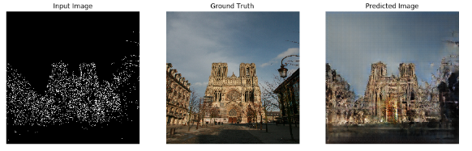
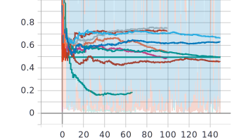

# 6-GAN Generator for Urban Buildings

  

 

# Project Goals

The goal of this project is to generate, through the use of a Generative Adversarial Network (or GAN), an output image of a building, translating the input image entered, heither photos or sketches. 
Starting from an **automatically generated edge mask**, the pix2pix model works by training on pairs of images, learning to generate an artistic representation of the reality. 
Various simulation of the same object can be obtained by training the network with images of different architecture style. 

​ 

# How does pix2pix Network work?
Pix2pix network uses 2 networks to train.

* *Generator*
* *Discriminator*
 
Generator will attempt to generate an output image from the input training data and Discriminator will attempt to identify whether the output is false or real. So both networks will try to increase their accuracy which will ultimately result in a really good Generator. 
So basically two neural networks contest with each other in a game (in the sense of game theory, often but not always in the form of a zero-sum game). 
 
The two-model framework corresponds to a minimax two-player game. 
in decision theory, **minimax is a method of minimizing the maximum possible loss (minimax)** 
 

# Input mask creation
source: https://towardsdatascience.com/canny-edge-detection-step-by-step-in-python-computer-vision-b49c3a2d8123 
source: https://datacarpentry.org/image-processing/08-edge-detection/ 

The idea behind the project is to train our GAN with photos of buildings and their respective edge masks, which can be created from any photo that makes up our dataset. 

The advantage of this method is that it will allow us to **make predictions even with simple drawings**, as this mask can also be obtained from those. 

In edge detection, we find the boundaries or edges of objects in an image, by determining where the brightness of the image changes dramatically.  
Edge detection can be used to extract the structure of objects in an image.  
If we are interested in the number, size, shape, or relative location of objects in an image, edge detection allows us to focus on the parts of the image most helpful, while ignoring parts of the image that will not help us.

 

# GAN parameters

In the present work different tests have been made, changing different paremeters in the generator and in the discriminator to evaluate how it varied according to the loss function.  
In the tests, the same sample of 200 photos was chosen, and then applied to a dataset of 1000 photos for the final workout.

Another parameter that must be taken into account is that neither the generator nor the discriminator must dominate one another, at least for most of the training

Different dropout levels, batch normalization and activation functions (Leaky ReLU, ReLU, Softmax) have been evaluated. 
 

# Application interface in Tkinter

A small application was made in Tkinter to test its functionality. 
To start it, write the following line of code in the terminal: 
`python3 main.py` 
 

# Knowledge

* TensorFlow
* Keras
* Generative adversarial network (GAN)
* Image Processing
* Image Inpainting
* Tkinter
* Statistic
* Import external libraries
* Data Cleaning
 
 

# Links & Resources

- [https://www.tensorflow.org/tutorials/generative/pix2pix?hl=pt-br]
- [https://www.tensorflow.org/tutorials/generative/dcgan]
- [https://blog.paperspace.com/implementing-gans-in-tensorflow/]
- [https://machinelearningmastery.com/how-to-develop-a-pix2pix-gan-for-image-to-image-translation/]
- [https://machinelearningmastery.com/how-to-develop-a-conditional-generative-adversarial-network-from-scratch/]
- [https://towardsdatascience.com/gan-pix2pix-generative-model-c9bf5d691bac]